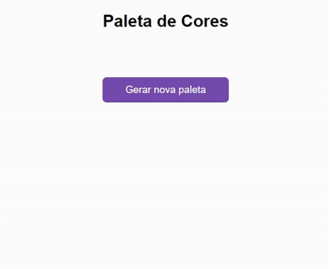

# Gerador de Paleta de Cores

Projeto desenvolvido em HTML,CSS e Java Script. O site desenvolvido é um gerador de paleta de cores.

🔗 [Click here to access](https://n4ju15.github.io/paleta_de_cores/)

## Tecnologias

- HTML
- CSS
- JavaScript
- Git and Github

